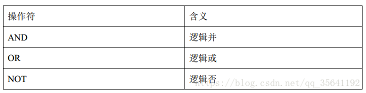

# 查询语法

## 1. 创建数据表，写入数据
### 1.1 建表
```sql
use dev;
drop table dev.student_info_score;
create table if not exists dev.student_info_score(
name string,
gender string,
age int,
student_id string,
subject string,
score int)
ROW FORMAT DELIMITED FIELDS TERMINATED BY '\t' 
lines terminated by '\n' STORED AS TEXTFILE;
```


### 1.2 写入数据
```sql
load data local inpath 'student_info_score' into table dev.student_info_score;
```


## 2. 查询数据
### 2.1 查询全部数据 (基础函数) 

**（1）基本语法：**

select * from `表`;

**（2）示例：**

```sql
select * from dev.student_info_score;
```
**（3）结果：**


### 2.2 查询部分数据 (limit 函数)

**（1）基本语法：**

select * from `表` limit 5;

**（2）示例：**

```sql
select * from dev.student_info_score limit 5;
```
**（3）结果：**


### 2.3 查询部分字段数据 (基础函数) 

**（1）基本语法：**

select `字段1`, `字段2` from `表` limit 5;

**（2）示例：**

```sql
select name, subject, score from dev.student_info_score limit 5;
```
**（3）结果：**


### 2.4 查询数据行数 (count 函数)

**（1）基本语法：**

select count(\*) from `表`;

**（2）示例：**

```sql
select count(*) as cnt from dev.student_info_score;

或

select count(1) as cnt from dev.student_info_score;
```
**（3）结果：**


**（4）说明：**

as cnt 是别名。


### 2.5 查询成绩最大值 (max 函数)

**（1）基本语法：**

select max(`字段`) from `表`;

**（2）示例：**

```sql
select max(score) as max_score from dev.student_info_score;
```
**（3）结果：**


**（4）说明：**

as max_score 是别名。


### 2.6 查询成绩最小值 (min 函数)

**（1）基本语法：**

select min(`字段`) from `表`;

**（2）示例：**

```sql
select min(score) as min_score from dev.student_info_score;
```
**（3）结果：**


**（4）说明：**

as min_score 是别名。


### 2.7 查询成绩总值 (sum 函数)

**（1）基本语法：**

select sum(`字段`) from `表`;

**（2）示例：**

```sql
select sum(score) as sum_score from dev.student_info_score;
```
**（3）结果：**


**（4）说明：**

as sum_score 是别名。


### 2.8 查询成绩平均值 (avg 函数)

**（1）基本语法：**

select avg(`字段`) from `表`;

**（2）示例：**

```sql
select avg(score) as avg_score from dev.student_info_score;
```
**（3）结果：**


**（4）说明：**

as avg_score 是别名。


### 2.9 查询符合条件的数据 (where 函数) 

**（1）基本语法：**

select * from `表` where `条件`;

**（1.1）比较运算符 (between / in / is null / is not null / like / rlike)**

下面表中描述了谓词操作符，这些操作符同样可以用于 join ... on 和 having 语句中。 

**like说明：**

`%` 代表零个或多个字符(任意个字符)。 

`_` 代表一个字符。 

**rlike说明：**

rlike 是 Hive 中这个功能的一个扩展，其可以通过 Java 的正则表达式这个更强大的语言来指定匹配条件。 


**（1.2）示例：**

```sql
（a）查询成绩等于 90 的数据 

select * from dev.student_info_score where score=90; 

（b）查询成绩在 70 到 90 的数据

select * from dev.student_info_score where score between 70 and 90; 

（c）查询成绩非空的数据 

select * from dev.student_info_score where score is not null; 

（d）查询成绩是 72 和 90 的数据

select * from dev.student_info_score where score in (72, 90);

（e）查找以 z 开头 name 的数据

select * from dev.student_info_score where name like 'z%'; 

（f）查找第三个字符为 a 的数据

select * from dev.student_info_score where name like '__a%'; 

（g）查找 name 中含有 a 的数据

select * from dev.student_info_score where name rlike '[a]';

```

**（1.3）结果：**


**（2.1）逻辑运算符 (and / or/ not)**




**（2.2）示例：**
```sql
（h）查询成绩大于 90，name 是 zhao

select * from dev.student_info_score where score>80 and name='zhao'; 

（i）查询成绩大于 90，或者 gender 是 F

select * from dev.student_info_score where score>90 or gender='F'; 

（j）查询 subject 除了 math 和 english 以外的数据

select * from dev.student_info_score where subject not in('math', 'english');
```

**（2.3）结果：**


### 2.10 分组 (group by 函数) 

group by 语句通常会和聚合函数一起使用，按照一个或者多个列队结果进行分组，然后对每个组执行聚合操作。

**（1）基本语法：**

select `字段`, `聚合函数` from `表` group by `字段`;


**（2）示例：**

```sql
（a）计算每个人的平均成绩

select name, avg(score) avg_score from dev.student_info_score group by name; 

（b）计算 gender, subject 的最高成绩

select gender, subject,  max(score) max_score from from dev.student_info_score group by gender, subject;

```


### 2.11 分组+筛选 (group by 函数 + where， group by 函数 + having) 

**having 与 where 不同点：**

+ where 针对表中的列发挥作用，查询数据； having 针对查询结果中的列发挥作用，筛选数据。 

+ where 后面不能写分组函数，而 having 后面可以使用分组函数。 

+ having 只用于 group by 分组统计语句。


```sql
求每个 subject 的平均 score 大于 60 的 subject

select subject, avg(score) avg_score 
from empfrom dev.student_info_score
group by subject having avg_score > 60;

等价于

select * from
(select subject, avg(score) avg_score from dev.student_info_score group by subject) as subject_avg_score
where avg_score > 60;
```


