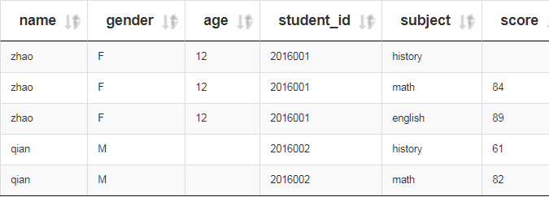
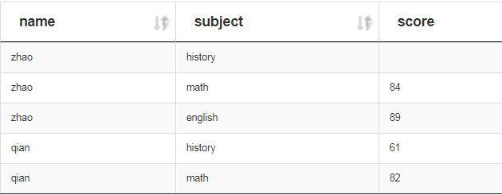
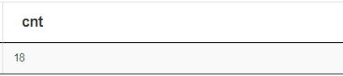
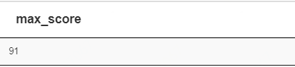
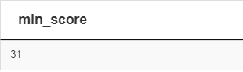
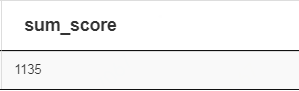
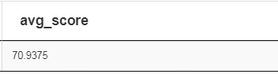
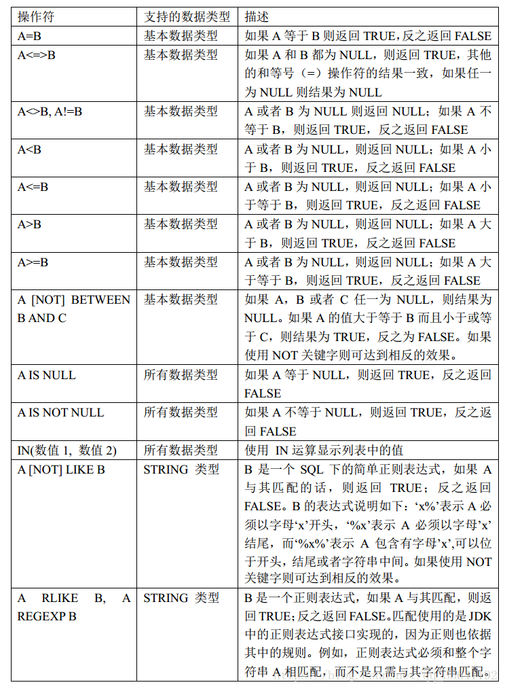

# 查询语法

## 1. 创建数据表，写入数据
### 1.1 建表
```sql
use dev;
drop table dev.student_info_score;
create table if not exists dev.student_info_score(
name string,
gender string,
age int,
student_id string,
subject string,
score int)
ROW FORMAT DELIMITED FIELDS TERMINATED BY '\t' 
lines terminated by '\n' STORED AS TEXTFILE;
```


### 1.2 写入数据
```sql
load data local inpath 'student_info_score' into table dev.student_info_score;
```


## 2. 查询数据
### 2.1 查询全部数据 (基础函数) 

（1）基本语法：

+ select * from `表`;

（2）示例：

```sql
select * from dev.student_info_score;
```
（3）结果：


### 2.2 查询部分数据 (limit 函数)

（1）基本语法：

+ select * from `表` limit 5;

（2）示例：

```sql
select * from dev.student_info_score limit 5;
```
（3）结果：




### 2.3 查询部分字段数据 (基础函数) 

（1）基本语法：

+ select `字段1`, `字段2` from `表` limit 5;

（2）示例：

```sql
select name, subject, score from dev.student_info_score limit 5;
```
（3）结果：




### 2.4 查询数据行数 (count 函数)

（1）基本语法：

+ select count(\*) from `表`;

（2）示例：

```sql
select count(*) as cnt from dev.student_info_score;
或
select count(1) as cnt from dev.student_info_score;
```
（3）结果：



（4）说明：

+ as cnt 是别名。


### 2.5 查询成绩最大值 (max 函数)

（1）基本语法：

+ select max(`字段`) from `表`;

（2）示例：

```sql
select max(score) as max_score from dev.student_info_score;
```
（3）结果：



（4）说明：

+ as max_score 是别名。


### 2.6 查询成绩最小值 (min 函数)

（1）基本语法：

+ select min(`字段`) from `表`;

（2）示例：

```sql
select min(score) as min_score from dev.student_info_score;
```
（3）结果：



（4）说明：

+ as min_score 是别名。


### 2.7 查询成绩总值 (sum 函数)

（1）基本语法：

+ select sum(`字段`) from `表`;

（2）示例：

```sql
select sum(score) as sum_score from dev.student_info_score;
```
（3）结果：



（4）说明：

+ as sum_score 是别名。


### 2.8 查询成绩平均值 (avg 函数)

（1）基本语法：

+ select avg(`字段`) from `表`;

（2）示例：

```sql
select avg(score) as avg_score from dev.student_info_score;
```
（3）结果：



（4）说明：

+ as avg_score 是别名。


### 2.9 查询符合条件的数据 (where 函数) 

（1）基本语法：

+ select * from `表` where `条件`;

（1.1）比较运算符 (between / in / is null / is not null)

下面表中描述了谓词操作符，这些操作符同样可以用于 JOIN…ON 和 HAVING 语句中。 



（1.2）示例：

```sql
（a）查询成绩等于 90 的数据 
select * from dev.student_info_score where score=90; 

（b）查询成绩在 70 到 90 的数据
select * from dev.student_info_score where score between 70 and 90; 

（c）查询成绩非空的数据 
select * from dev.student_info_score where score is not null; 

（d）查询成绩是 72 和 90 的数据
select * from dev.student_info_score where score in (72, 90);

```

（1.3）结果：
