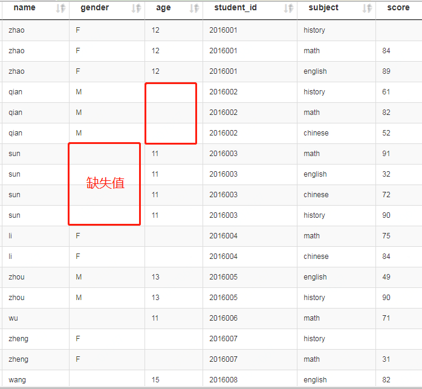
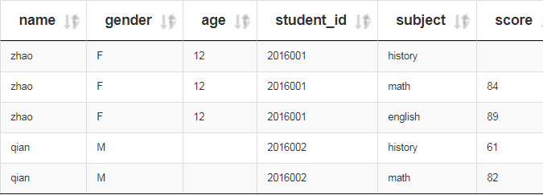
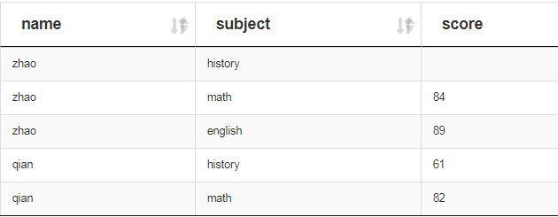
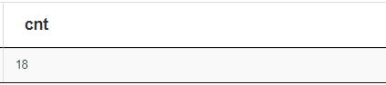

# 查询语法

## 1. 创建数据表，写入数据
### 1.1 建表
```sql
`hive> `use dev;
`hive> `drop table dev.student_info_score;
`hive> `create table if not exists dev.student_info_score(
name string,
gender string,
age int,
student_id string,
subject string,
score int)
ROW FORMAT DELIMITED FIELDS TERMINATED BY '\t' 
lines terminated by '\n' STORED AS TEXTFILE;
```

### 1.2 写入数据
```sql
`hive> `load data local inpath 'student_info_score' into table dev.student_info_score;
```

## 2. 查询数据
### 2.1 查询全部数据 (select * from `表`)
```sql
`hive> `select * from dev.student_info_score;
```
`结果如下：`




### 2.2 查询部分数据 (select * from `表` limit 5)
```sql
`hive> `select * from dev.student_info_score limit 5;
```
`结果如下：`




### 2.3 查询部分字段数据 (select `字段1`, `字段2` from `表` limit 5)
```sql
`hive> `select name, subject, score from dev.student_info_score limit 5;
```
`结果如下：`




### 2.4 查询数据行数 (select count(\*) from `表`)
```sql
`hive> `select count(*) as cnt from dev.student_info_score;
或
`hive> `select count(1) as cnt from dev.student_info_score;
```
`结果如下：`



`说明：` as cnt 是别名。