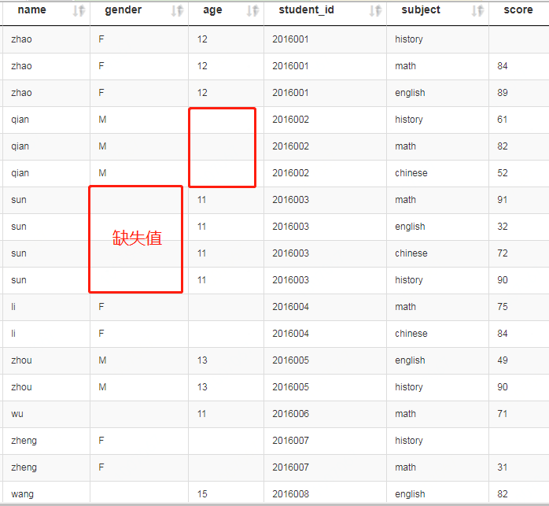
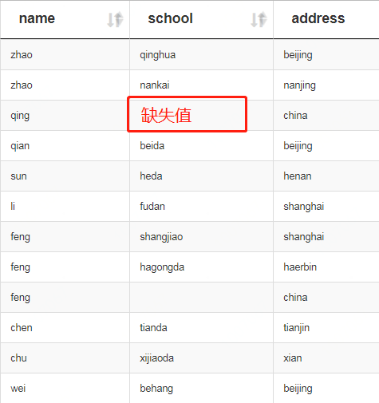
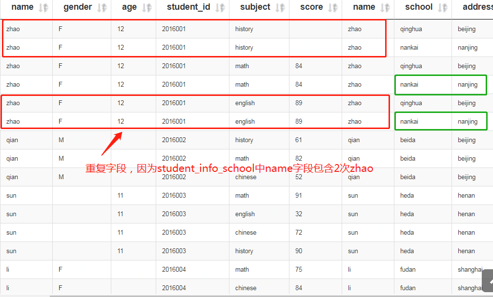
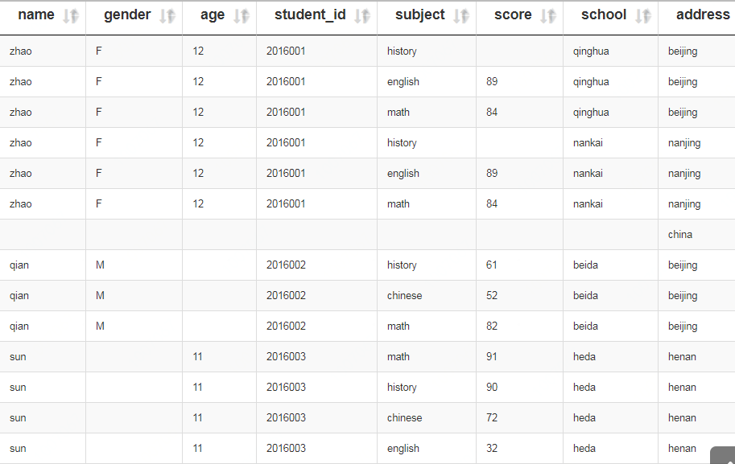
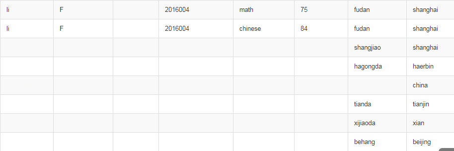

# join语法

## 1. 创建数据表，写入数据
### 1.1 建表
```sql
use dev;
drop table dev.student_info_score;
create table if not exists dev.student_info_score(
name string,
gender string,
age int,
student_id string,
subject string,
score int)
ROW FORMAT DELIMITED FIELDS TERMINATED BY '\t' 
lines terminated by '\n' STORED AS TEXTFILE;
```

### 1.1 建表
```sql
use dev;
drop table dev.student_info_school;
create table if not exists dev.student_info_school(
name string,
school string,
address string)
ROW FORMAT DELIMITED FIELDS TERMINATED BY '\t' 
lines terminated by '\n' STORED AS TEXTFILE;
```


### 1.2 写入数据
```sql
load data local inpath './data/student_info_score' into table dev.student_info_score;
load data local inpath './data/student_info_school' into table dev.student_info_school;
```


### 1.3 结果





## 2. join操作

### 2.1 内连接 (inner join)

**（1）基本语法：**

select `表1.字段1`, `表1.字段2`, `表2.字段1`, `表2.字段2`
from 
`表1`
inner join
`表2`
on `表1.字段1`=`表2.字段2`;

**（2）示例：**

```sql
select a.*, b.* from 
dev.student_info_score a 
inner join 
dev.student_info_school b
on a.name=b.name;

或

select a.*, b.* from 
dev.student_info_score a,
dev.student_info_school b
where a.name=b.name;
```

**（3）结果：**



**（4）说明：**

a, b 是别名；

`*` 表示保留全部字段，可以选择保留部分字段，并选择去重；

内连接：只有两个表中都存在与连接条件相匹配的数据才会被保留下来。


### 2.2 左连接 (left join)

**（1）基本语法：**

select `表1.字段1`, `表1.字段2`, `表2.字段1`, `表2.字段2`
from 
`表1`
left join
`表2`
on `表1.字段1`=`表2.字段2`;

**（2）示例：**

```sql
select a.*, b.school from 
dev.student_info_score a 
left join 
dev.student_info_school b
on a.name=b.name;
```

**（3）结果：**


**（4）说明：**

左外连接：JOIN 操作符左表中符合 WHERE 子句的所有记录将会被返回。


### 2.3 右连接 (right join)

**（1）基本语法：**

select `表1.字段1`, `表1.字段2`, `表2.字段1`, `表2.字段2`
from 
`表1`
right join
`表2`
on `表1.字段1`=`表2.字段2`;

**（2）示例：**

```sql
select a.*, b.school from 
dev.student_info_score a 
right join 
dev.student_info_school b
on a.name=b.name;
```

**（3）结果：**




**（4）说明：**

左外连接：JOIN 操作符右表中符合 WHERE 子句的所有记录将会被返回。