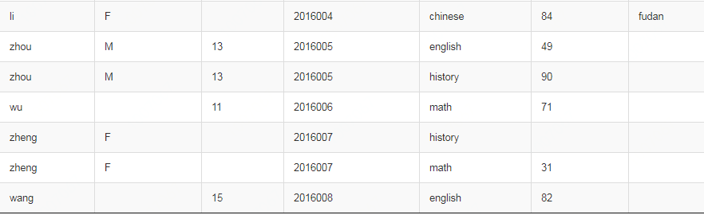
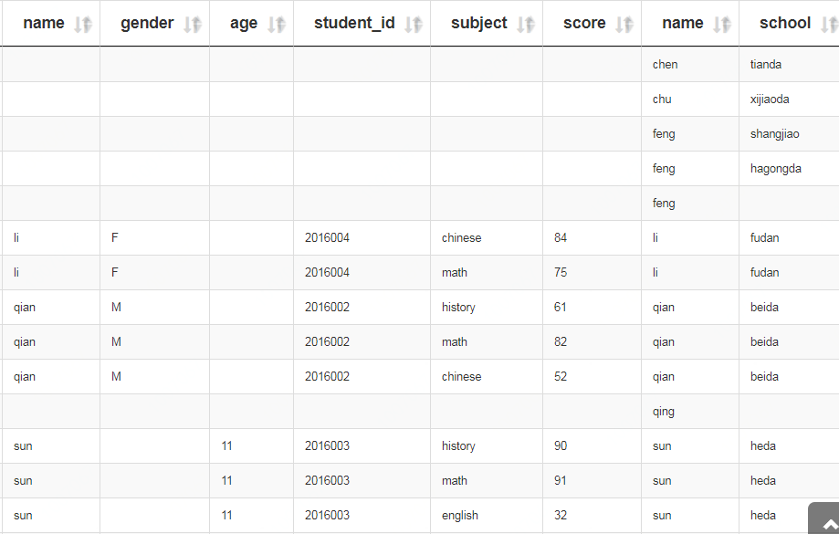
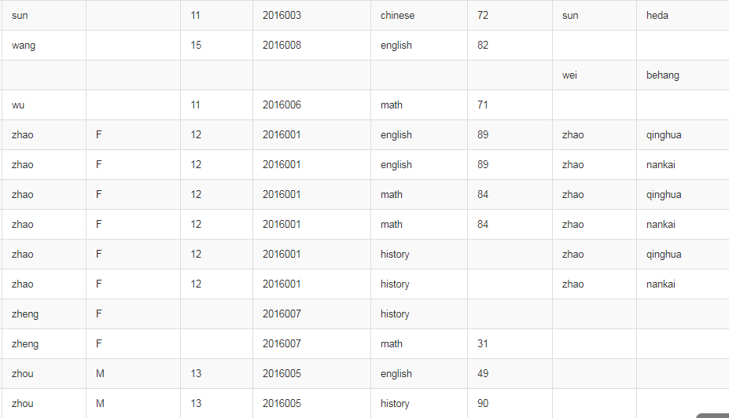

# join语法

## 1. 创建数据表，写入数据
### 1.1(a) 建表
```sql
use dev;
drop table dev.student_info_score;
create table if not exists dev.student_info_score(
name string,
gender string,
age int,
student_id string,
subject string,
score int)
ROW FORMAT DELIMITED FIELDS TERMINATED BY '\t' 
lines terminated by '\n' STORED AS TEXTFILE;
```

### 1.1(b) 建表
```sql
use dev;
drop table dev.student_info_school;
create table if not exists dev.student_info_school(
name string,
school string,
address string)
ROW FORMAT DELIMITED FIELDS TERMINATED BY '\t' 
lines terminated by '\n' STORED AS TEXTFILE;
```


### 1.2 写入数据
```sql
load data local inpath './data/student_info_score' into table dev.student_info_score;

load data local inpath './data/student_info_school' into table dev.student_info_school;
```


### 1.3 结果

表(a)结果


表(b)结果


## 2. join操作

### 2.1 内连接 (inner join)

**（1）基本语法：**

select `表1.字段1`, `表1.字段2`, `表2.字段1`, `表2.字段2`
from 
`表1`
inner join
`表2`
on `表1.字段1`=`表2.字段2`;

**（2）示例：**

```sql
select a.*, b.* from 
dev.student_info_score a 
inner join 
dev.student_info_school b
on a.name=b.name;

等价于

select a.*, b.* from 
dev.student_info_score a,
dev.student_info_school b
where a.name=b.name;
```

**（3）结果：**


**（4）说明：**

a, b 是别名；

`*` 表示保留全部字段，可以选择保留部分字段，并选择去重；

内连接：只有两个表中都存在与连接条件相匹配的数据才会被保留下来。


### 2.2 左外连接 (left join)

**（1）基本语法：**

select `表1.字段1`, `表1.字段2`, `表2.字段1`, `表2.字段2`
from 
`表1`
left join
`表2`
on `表1.字段1`=`表2.字段2`;

**（2）示例：**

```sql
select a.*, b.school from 
dev.student_info_score a 
left join 
dev.student_info_school b
on a.name=b.name;
```

**（3）结果：**




**（4）说明：**

左外连接：join 操作符左表中符合 where 子句的所有记录将会被返回。


### 2.3 右外连接 (right join)

**（1）基本语法：**

select `表1.字段1`, `表1.字段2`, `表2.字段1`, `表2.字段2`
from 
`表1`
right join
`表2`
on `表1.字段1`=`表2.字段2`;

**（2）示例：**

```sql
select a.*, b.school, b.address from 
dev.student_info_score a 
right join 
dev.student_info_school b
on a.name=b.name;
```

**（3）结果：**


**（4）说明：**

左外连接：join 操作符右表中符合 where 子句的所有记录将会被返回。


### 2.4 满外连接 (full join)

**（1）基本语法：**

select `表1.字段1`, `表1.字段2`, `表2.字段1`, `表2.字段2`
from 
`表1`
full join
`表2`
on `表1.字段1`=`表2.字段2`;

**（2）示例：**

```sql
select a.*, b.* from 
dev.student_info_score a 
full join 
dev.student_info_school b
on a.name=b.name;
```

**（3）结果：**




**（4）说明：**

满外连接：将会返回所有表中符合 where 语句条件的所有记录。如果任一表的指定字段没有符合条件的值的话，那么就使用 NULL 值替代。


### 2.4 多表连接

**（1）基本语法：**

select `表1.字段1`, `表1.字段2`, `表2.字段1`, `表2.字段2`, `表3.字段1`, `表3.字段2`
from 
`表1`
[left] join `表2` on `表1.字段1`=`表2.字段2`
[left] join `表3` on `表1.字段1`=`表3.字段2`;

**（2）示例：**

```sql
select `表1.字段1`, `表1.字段2`, `表2.字段1`, `表2.字段2`, `表3.字段1`, `表3.字段2`
from 
`表1`
join (or left join) `表2` on `表1.字段1`=`表2.字段2`
join (or left join) `表3` on `表1.字段1`=`表3.字段2`;
```

**（3）结果：**

无

**（4）说明：**

[left] 表示可有可无，left join 表示左连接，join 表示 inner join。

多表连接：连接 n 个表，至少需要 n-1 个连接条件。例如：连接三个表，至少需要两个连接条件。

大多数情况下，Hive 会对每对 join 连接对象启动一个 MapReduce 任务。本例中会首先启动一个 MapReduce job 对表 1 和表 2 进行连接操作，然后会再启动一个 MapReduce job 将第一个 MapReduce job 的输出和表 3 进行连接操作。

注意：为什么不是表d和表l先进行连接操作呢？这是因为Hive总是按照从左到右的顺序执行的。


### 2.5 笛卡尔积

**（1）基本语法：**

select `表1.*`, `表2.*` 
from
`表1.*`
join
`表2.*` 
on 1=1;

**（2）示例：**

```sql
select `表1.*`, `表2.*` 
from
`表1.*`
join
`表2.*` 
on 1=1;
```

**（3）结果：**

无

**（4）说明：**

笛卡尔集会在下面条件下产生：省略连接条件；连接条件无效；所有表中的所有行互相连接。

笛卡尔积的表行数 = 表A行数 * 表B行数
